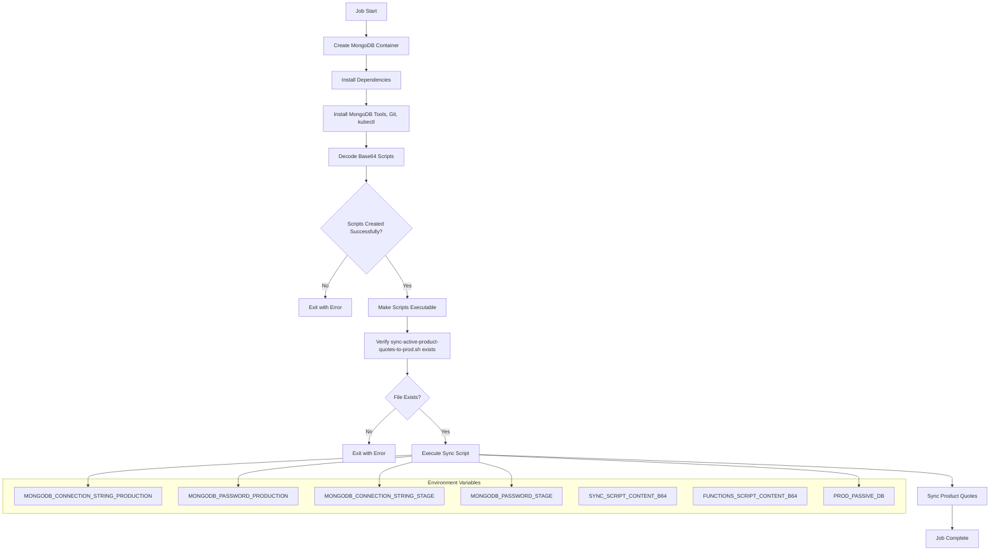
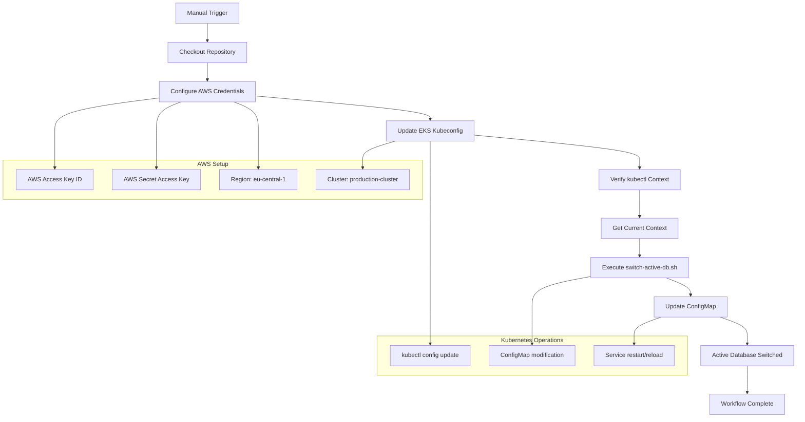

# Product Service Release

This repository contains workflows for managing product service database operations, including database synchronization and active database switching.

## Workflows

### 1. Sync Product Quotes Job (`sync-product-quotes-job.yaml`)

This Kubernetes Job synchronizes product quotes between staging and production databases. It's designed to keep the databases in sync by transferring active product quotes from one environment to another.

#### Process Flow

#### Key Features
- **Base64 Script Injection**: Scripts are injected as base64-encoded environment variables for security
- **Error Handling**: Comprehensive error checking at each step
- **Resource Management**: Memory and CPU limits set to 512Mi/250m
- **TTL**: Job automatically cleaned up after 3 days (259200 seconds)
- **Database Connectivity**: Connects to both staging and production MongoDB clusters

### 2. PIM DB Release Workflow (`pim-db-release.yml`)

This GitHub Actions workflow switches the active database in the product-service by updating the Kubernetes ConfigMap in the production cluster. It's typically used for database release management and failover scenarios.

#### Process Flow

#### Key Features
- **Manual Trigger**: Workflow runs only when manually triggered via workflow_dispatch
- **AWS EKS Integration**: Automatically configures access to production EKS cluster
- **Zero-Downtime Switching**: Updates ConfigMap to switch active database reference
- **Verification Steps**: Multiple verification steps ensure proper kubectl configuration
- **Production Safety**: Operates directly on production cluster with proper AWS credentials

## Usage

### Sync Product Quotes Job
This job is typically scheduled or triggered when you need to synchronize product quotes between environments:
- Ensure all environment variables are properly set in your Kubernetes cluster
- The job will create a temporary pod that handles the synchronization
- Monitor the job logs for any errors during the sync process

### PIM DB Release
This workflow is used for database release management:
1. Navigate to the Actions tab in GitHub
2. Select "PIM DB Release" workflow
3. Click "Run workflow" button
4. The workflow will switch the active database in the production environment

## Prerequisites

- AWS credentials with EKS access permissions
- MongoDB connection strings and passwords for both environments
- Properly configured Kubernetes cluster with necessary permissions
- Base64 encoded sync scripts prepared as environment variables
